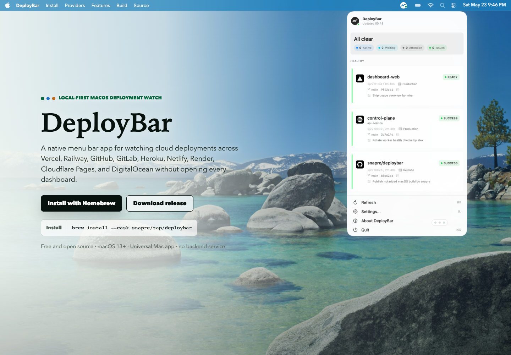

# DeployBar

DeployBar is for the moment after you hit deploy and start checking too many tabs.

If one service is building on Vercel, another release is rolling through Heroku, and a side project is waiting on Railway or GitHub Deployments, you should not need a row of dashboards open just to know whether anything needs attention. DeployBar turns that refresh loop into one native macOS menu bar status, one compact popover, and notifications when a deployment starts, ships, fails, cancels, or disappears.

This is the first public launch of DeployBar: a free, open-source, local-first Mac app built in Swift. There is no Electron shell, no DeployBar backend service, and no hosted credential sync.

Install the latest signed and notarized release with Homebrew Cask:

```bash
brew install --cask snapre/tap/deploybar
```



## Why DeployBar

- Replace the deployment-dashboard checking loop with one menu bar snapshot.
- See active, waiting, failed, and healthy deployments in a native popover.
- Let macOS notify you when a deploy starts, ships, fails, cancels, or is removed.
- Keep provider breadth as an implementation detail: Vercel, Railway, Netlify, Render, Cloudflare Pages, DigitalOcean App Platform, Heroku, Fly.io, GitHub Deployments, and GitLab Deployments are normalized into the same status model.
- Run it locally. Tokens stay in Keychain, and non-secret settings stay on your Mac.

The project is intentionally native: Swift 6, Swift Package Manager, SwiftUI for popover/settings surfaces, and AppKit `NSStatusItem` for menu bar integration.

## Trust model

- Free and open source under the [MIT License](LICENSE).
- Local-first by design: no DeployBar backend service and no hosted credential sync.
- Provider tokens are stored in macOS Keychain, not JSON settings, logs, or diagnostics.
- See [PRIVACY.md](PRIVACY.md) for data handling and [SECURITY.md](SECURITY.md) for vulnerability reporting.

## First public release

The launch build currently contains:

- menu bar app shell with no Dock icon when packaged as an app bundle
- custom status/menu bar glyph and packaged app icon
- SwiftUI popover showing provider-agnostic deployment snapshots
- settings UI with Providers, Diagnostics, and About tabs for refresh cadence, mock data, provider token entry, discovery, and monitored targets
- Keychain token wrapper using service `com.deploybar.tokens`
- local JSON settings store for non-secret settings
- mock provider with queued/building/ready/failed snapshots
- Vercel REST provider for deployment listing and project/environment discovery
- Railway GraphQL provider for deployment listing and read-only discovery of projects, services, and environments
- Netlify, Render, Cloudflare Pages, DigitalOcean App Platform, Heroku, Fly.io, GitHub deployments, and GitLab deployments providers
- refresh scheduling with stale snapshot retention, issue backoff, and faster polling while deployments are live
- macOS notifications for deployment start, ready/success, failed/error/crashed, canceled, or removed states
- tests for status mapping, response parsing, provider requests and discovery, redaction, monitored target matching, and refresh behavior

The next implementation phase is deeper provider diagnostics, optional failure log tailing, and more polish around account/resource discovery.

## Installation

Homebrew is the primary install path for the public launch:

```bash
brew install --cask snapre/tap/deploybar
```

## Development

Build and test:

The package targets macOS 13+ and uses Swift 6.

```bash
swift build
swift test
```

Run directly from SwiftPM:

```bash
swift run DeployBar
```

AI-assisted contributors can use [AGENT.md](AGENT.md) for project boundaries, architecture notes, and review expectations.

Package a local `.app` bundle with `LSUIElement` and the DeployBar icon enabled:

```bash
./Scripts/package_app.sh
open .build/DeployBar.app
```

Release builds include Sparkle app updates when these GitHub Actions secrets are set:

- `DEPLOYBAR_SPARKLE_PUBLIC_ED_KEY`: the public EdDSA key embedded in `Info.plist`
- `SPARKLE_PRIVATE_KEY`: the exported private EdDSA key used to sign `appcast.xml`

The packaged app uses the latest GitHub Release asset at `https://github.com/snapre/DeployBar/releases/latest/download/appcast.xml` as its Sparkle feed.

## Configuration

Non-secret settings are stored as JSON under:

```text
~/Library/Application Support/DeployBar/settings.json
```

API tokens are stored only in Keychain:

```text
service: com.deploybar.tokens
account: <provider>:<token-reference>
```

Provider identity, token references, and monitored targets are stored per account so credentials stay isolated.

## Provider plan

### Vercel

Data source: official Vercel REST API, `GET https://api.vercel.com/v6/deployments`.

Confirmed parameters include `teamId`, `slug`, `projectId`, `target`, `branch`, `sha`, `state`, and pagination fields. DeployBar maps `QUEUED`, `INITIALIZING`, `BUILDING`, `READY`, `ERROR`, and `CANCELED` into the unified status model.

DeployBar can discover Vercel projects from Settings and uses recent deployment hints to populate common environments and branches.

### Railway

Data source: Railway Public GraphQL API, `POST https://backboard.railway.com/graphql/v2`.

Confirmed shape uses Relay-style pagination for `deployments(input:, first:, after:)`. Railway account/workspace tokens use `Authorization: Bearer <token>`, while project tokens use `Project-Access-Token: <token>`. Railway targets require at least a service ID and environment ID.

DeployBar can discover Railway resources from Settings. Account/workspace tokens can fill projects, services, and environments. Project tokens can reliably reveal project/environment scope via `projectToken`; service discovery may still require manual service ID entry depending on token permissions.

### Netlify

Data source: official Netlify REST API, `GET https://api.netlify.com/api/v1/sites` and `GET /api/v1/sites/{site_id}/deploys`.

When no target is configured, DeployBar lists accessible sites and polls recent deploys for each site. Optional targets can narrow by site, context, or branch.

### Render

Data source: official Render REST API, `GET https://api.render.com/v1/services` and `GET /v1/services/{service_id}/deploys`.

When no target is configured, DeployBar lists accessible services and polls recent deploys for each service. Optional targets can narrow by service.

### Cloudflare Pages

Data source: Cloudflare API v4, `GET /client/v4/accounts/{account_id}/pages/projects` and `GET /pages/projects/{project_name}/deployments`.

Cloudflare Pages requires the account ID in addition to the API token. When no target is configured, DeployBar lists Pages projects for that account and polls recent deployments for each project.

### DigitalOcean App Platform

Data source: DigitalOcean Apps API, `GET https://api.digitalocean.com/v2/apps` and `GET /v2/apps/{app_id}/deployments`.

When no target is configured, DeployBar lists accessible apps and polls recent deployments for each app.

### Heroku

Data source: Heroku Platform API, `GET https://api.heroku.com/apps` and `GET /apps/{app}/releases`.

Heroku releases are mapped as deployments. Note that releases can include config/add-on changes, not only code deploys.

### Fly.io

Data source: Fly.io GraphQL API, `POST https://api.fly.io/graphql`, listing apps and each app's `releasesUnprocessed` history.

Fly.io releases are mapped as deployments. The GraphQL API is undocumented and unversioned, so schema changes surface as an "API changed" issue rather than silently dropping data. Use a `FlyV1` token from `fly tokens create readonly` for app discovery, or another app/org-scoped token for the apps you want to watch. Legacy `fly auth token` Bearer tokens are still accepted.

### GitHub Deployments

Data source: GitHub REST API, `GET /repos/{owner}/{repo}/deployments` plus latest deployment status from `statuses_url`.

GitHub requires at least one repository target, such as `owner/repo`, because there is no account-wide deployments list.

### GitLab Deployments

Data source: GitLab REST API, `GET /projects/{id}/deployments`.

GitLab requires at least one project target. Use a numeric project ID for the most reliable API path; an optional API base URL can be set for self-managed GitLab instances.

## Extending providers

Additions should stay provider-local:

1. Add a `ProviderID` case and `ProviderDescriptor`.
2. Implement `DeploymentProvider`.
3. Add provider-specific response models/parser.
4. Register the provider in `DeploymentStore`.
5. Add focused tests for status mapping, parsing, request headers, and failure behavior.

## Privacy

DeployBar is local-first. Tokens are never written to JSON settings, logs, or diagnostic UI. Debug text should pass through redaction before display. The app may request notification permission for deployment status alerts, but does not request Full Disk Access, Accessibility, or Screen Recording.

## Attribution

DeployBar is inspired by the product shape and provider architecture ideas in [steipete/CodexBar](https://github.com/steipete/CodexBar), which is MIT licensed. No CodexBar source code is copied in this scaffold.
